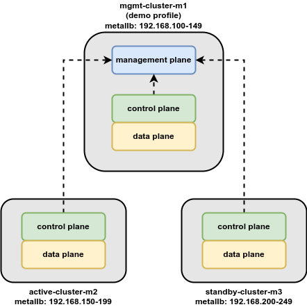
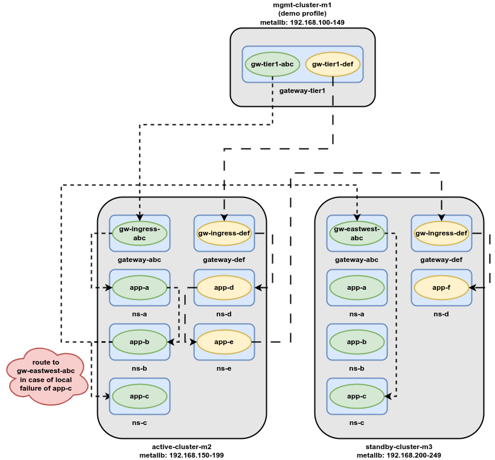
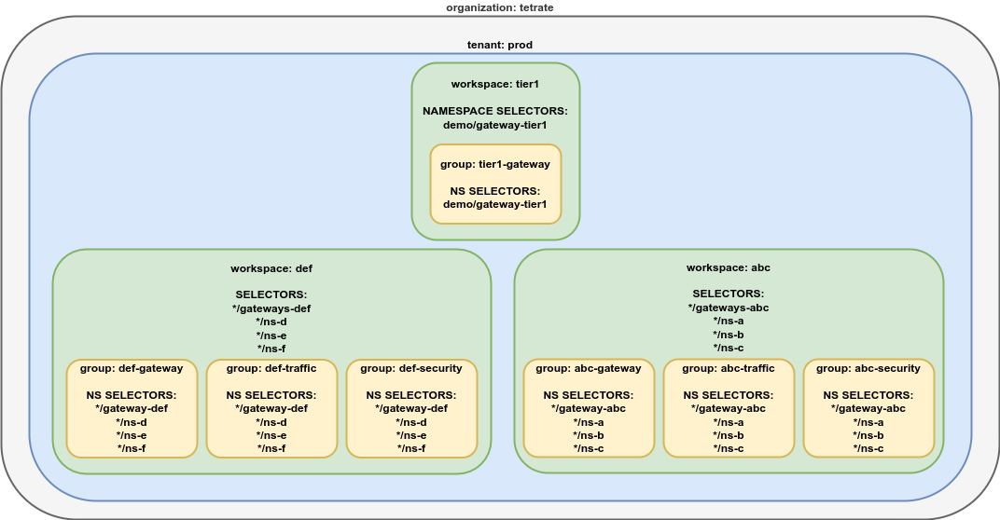

# Tetrate Service Bridge on Minikube


## Introduction

The purpose of this repo is to showcase TSB multi cluster and VM onboarding capabilities. In order to do so, we
will deploy a micro-service based demo application called **App ABC**:

 - You have the ability to deploy it in active mode
 - You have the ability to deploy it in active/standby mode
 - You have the ability to deploy it on VMs

We will be using [minikube](https://minikube.sigs.k8s.io/docs/start) and [virtualbox](https://www.virtualbox.org) to spin up the demo environment.

Before digging into the demo ENV itself, we highly recommend reading up on the conceptual
introduction in our official documentation [here](https://docs.tetrate.io/service-bridge/1.6.x/en-us/concepts).

## Prequisites

The demo is fully scripted using shell scripts and makefile target.

```console
$ make
help                           This help
prereqs                        Make sure prerequisites are satisfied
infra-mgmt-up                  Bring up and configure mgmt minikube cluster
infra-active-up                Bring up and configure active minikube cluster
infra-standby-up               Bring up and configure standby minikube cluster
infra-vm-up                    Bring up and configure vms
infra-mgmt-down                Bring down and delete mgmt minikube cluster
infra-active-down              Bring down and delete active minikube cluster
infra-standby-down             Bring down and delete standby minikube cluster
infra-vm-down                  Bring down and delete vms
tsb-mgmt-install               Install TSB management/control/data plane in mgmt cluster (demo profile)
tsb-active-install             Install TSB control/data plane in active cluster
tsb-standby-install            Install TSB control/data plane in stanby cluster
reset-tsb                      Reset all TSB configuration
deploy-app-abc-k8s             Deploy abc application on kubernetes
deploy-app-abc-vm              Deploy abc application on vms
undeploy-app-abc-k8s           Undeploy abc application from kubernetes
undeploy-app-abc-vm            Undeploy abc application from vms
test-app-abc                   Generate curl commands to test ABC traffic
info                           Get infra environment info
clean                          Clean up all resources
```

In order to be able to sync the TSB docker images, you will need to set the following
environment variables before running the scripts.

```console
export TSB_DOCKER_USERNAME=<username>
export TSB_DOCKER_PASSWORD=<password>
```

Note that the following binaries needs to be installed and runnable on the system:

 - **awk** : to parse command line output
 - **curl** : to download cloud ubuntu vm
 - **docker** : to pull tsb images
 - **expect** : to automate shell interaction
 - **genisoimage** : to generate cloud-init for vms
 - **kubectl** : to interact with the kubernetes clusters
 - **minikube** : we will be using the virtualbox driver
 - **tctl** : the command line utility to interact with the tsb api's
 - **vboxmanage** : to automate vm handling

**DOC REF** Installation instructions for tctl can be found [here](https://docs.tetrate.io/service-bridge/1.6.x/en-us/reference/cli/guide/index#installation)


## Architecture

### TSB cluster design

The following diagram shows the overal architecture of the demo in terms of how various TSB 
components are deployed throughout the 3 clusters.

<p align="center">



**DOC REF** More information on the overal TSB architecture and its different components can
be found [here](https://docs.tetrate.io/service-bridge/1.6.x/en-us/concepts/architecture)

### Kubernetes deployment design

#### Active/Standby

The following diagram shows to application deployments and its corresponding tier1, ingress and
east-west gateways for an active/standby scenario.

<p align="center">



Although ingress and eastwest gateways can be combined into one single gateway, we have chosen
to deploy seperate instances for the sake of clarity, seperation of concerns and security.

**DOC REF** More information on the different gateway types supported by TSB can be found
[here](https://docs.tetrate.io/service-bridge/1.6.x/en-us/howto/gateway)

#### Active/VMs

The following diagram shows to application deployments and its corresponding tier1, ingress and
east-west gateways for a k8s/vm scenario.


Although ingress and eastwest gateways can be combined into one single gateway, we have chosen
to deploy seperate instances for the sake of clarity, seperation of concerns and security.

**DOC REF** More information our different vm onboarding options can be found
[here](https://docs.tetrate.io/service-bridge/1.6.x/en-us/setup/workload_onboarding)


### TSB multi-tenancy design

The following diagram shows how we configured TSB multi-tenancy concepts like organization,
tenants, workspaces and groups, which form the foundation of our RBAC system and also play
an important role in the configuration of traffic control and security.



Note that TSB, by leveraging namespace selectors, is able to create an abstraction of your
application deployment strategy and therefor provides a mapping to your organizational 
structure, compared to traditional K8s RBAC approaches.

**DOC REF** More information on our tenancy concepts can be found in the official documentation [here](https://docs.tetrate.io/service-bridge/1.6.x/en-us/concepts/security)

Note also that the multi-tenancy design takes complete abstraction of your workloads in terms of where
and how they are hosted (PODs vs VMs).


## Installation

### STEP1: prepare minikube ENV

In order to be able to sync the TSB docker images, you will need to set the following
environment variables before preparing the minikube ENV.

```console
$ export TSB_DOCKER_USERNAME=<username>
$ export TSB_DOCKER_PASSWORD=<password>

$ make minikube-up
```

Note that this step might take some time (20-30min), as we need to pull all the TSB docker images
and also load them into the 3 different minikube profiles accordingly.

After this step has successfully completed, you should be able to interact with the
different clusters using kubectl.

```console
$ minikube profile list
|--------------------|-----------|---------|--------------|------|---------|---------|-------|--------|
|      Profile       | VM Driver | Runtime |      IP      | Port | Version | Status  | Nodes | Active |
|--------------------|-----------|---------|--------------|------|---------|---------|-------|--------|
| active-cluster-m2  | docker    | docker  | 192.168.49.3 | 8443 | v1.24.9 | Running |     1 |        |
| mgmt-cluster-m1    | docker    | docker  | 192.168.49.2 | 8443 | v1.24.9 | Running |     1 |        |
| standby-cluster-m3 | docker    | docker  | 192.168.49.4 | 8443 | v1.24.9 | Running |     1 |        |
|--------------------|-----------|---------|--------------|------|---------|---------|-------|--------|

$ kubectl --context mgmt-cluster-m1 get pods -A
NAMESPACE        NAME                                      READY   STATUS    RESTARTS   AGE
kube-system      coredns-57575c5f89-lgn6q                  1/1     Running   0          19m
kube-system      etcd-mgmt-cluster-m1                      1/1     Running   0          20m
kube-system      kube-apiserver-mgmt-cluster-m1            1/1     Running   0          20m
kube-system      kube-controller-manager-mgmt-cluster-m1   1/1     Running   0          20m
kube-system      kube-proxy-nmtsg                          1/1     Running   0          19m
kube-system      kube-scheduler-mgmt-cluster-m1            1/1     Running   0          20m
kube-system      storage-provisioner                       1/1     Running   0          20m
metallb-system   controller-6747c7bbcb-g9sbs               1/1     Running   0          18m
metallb-system   speaker-njl6k                             1/1     Running   0          18m

$ kubectl --context active-cluster-m2 get pods -A
NAMESPACE        NAME                                        READY   STATUS    RESTARTS      AGE
kube-system      coredns-57575c5f89-6c9d8                    1/1     Running   0             19m
kube-system      etcd-active-cluster-m2                      1/1     Running   0             19m
kube-system      kube-apiserver-active-cluster-m2            1/1     Running   0             19m
kube-system      kube-controller-manager-active-cluster-m2   1/1     Running   0             19m
kube-system      kube-proxy-gh9gt                            1/1     Running   0             19m
kube-system      kube-scheduler-active-cluster-m2            1/1     Running   0             19m
kube-system      storage-provisioner                         1/1     Running   1 (18m ago)   19m
metallb-system   controller-6747c7bbcb-gw4jc                 1/1     Running   0             18m
metallb-system   speaker-qnz78                               1/1     Running   0             18m

$ kubectl --context standby-cluster-m3 get pods -A
NAMESPACE        NAME                                         READY   STATUS    RESTARTS      AGE
kube-system      coredns-57575c5f89-2mm5t                     1/1     Running   0             18m
kube-system      etcd-standby-cluster-m3                      1/1     Running   0             19m
kube-system      kube-apiserver-standby-cluster-m3            1/1     Running   0             19m
kube-system      kube-controller-manager-standby-cluster-m3   1/1     Running   0             19m
kube-system      kube-proxy-4g6mz                             1/1     Running   0             18m
kube-system      kube-scheduler-standby-cluster-m3            1/1     Running   0             19m
kube-system      storage-provisioner                          1/1     Running   1 (18m ago)   19m
metallb-system   controller-6747c7bbcb-gddkj                  1/1     Running   0             18m
metallb-system   speaker-xvxvk                                1/1     Running   0             18m
```

### Step2: install TSB mgmt plane

In this step we will be installing the TSB management plane in the management cluster. We will be leveraging the demo profile that comes with tctl, as it ships with all the necessary external
dependancies of the TSB platform (postgres and elasticsearch). In a production ENV you will be
integrating this with external services.

Note that the demo profile also installs a control and data plane in the management cluster itself.
In a production ENV this is not strictly necessary however. We will also leverage this to host our
Tier1 Gateways, which will be the entrypoints for external traffic destined for application ABC and DEF.

```
$ make install-mgmt-plane

Switched to context "mgmt-cluster-m1".
namespace/istio-system created
secret/cacerts created
 ✓ Installing operators... 
 ✓ Waiting for CRDs to be registered by the operators... 
 ✓ Installing Redis... 
 ✓ Waiting for Deployments to become ready...
 ✓ Installing Managementplane XCP certs... 
 ✓ Installing Managementplane... 
 ✓ Waiting for Deployments to become ready... 
 ✓ Waiting for StatefulSet to become ready...
Configuring bridge address: 192.168.49.100:8443

Login Successful!
  Configured user: mgmt-cluster-m1-admin
  User "mgmt-cluster-m1-admin" enabled in profile: mgmt-cluster-m1
 ✓ Regenerating TSB certs with hosts [demo.tsb.tetrate.io 192.168.49.100] 
 ✓ Reloading Front Envoy...
 ✓ Fetching XCP central CA...
 ✓ Installing Controlplane... 
 ✓ Waiting for Deployments to become ready... 
Management Plane UI accessible at: https://192.168.49.100:8443
Admin credentials: username: admin, password: admin

$ kubectl --context mgmt-cluster-m1 get pods -A
NAMESPACE        NAME                                                    READY   STATUS      RESTARTS       AGE
cert-manager     cert-manager-656c56ff7c-6cmz5                           1/1     Running     0              3m28s
cert-manager     cert-manager-cainjector-5d4c4cd64c-mwd7r                1/1     Running     0              3m28s
cert-manager     cert-manager-startupapicheck-f6q9l                      0/1     Completed   0              3m28s
cert-manager     cert-manager-webhook-6f449bb5cf-mbrt7                   1/1     Running     0              3m28s
istio-gateway    istio-operator-8579f6d5db-fpp2d                         1/1     Running     0              2m23s
istio-gateway    tsb-operator-data-plane-54567fc4cf-7p2jd                1/1     Running     0              4m28s
istio-system     edge-5c454f7588-pl6jk                                   1/1     Running     0              44s
istio-system     istio-operator-d5896f8cd-x5dkd                          1/1     Running     0              2m14s
istio-system     istio-system-custom-metrics-apiserver-54f85d79f-xh987   1/1     Running     2 (119s ago)   2m3s
istio-system     istiod-55db5b49cc-kbmkf                                 1/1     Running     0              2m9s
istio-system     oap-deployment-7cd44dcb54-6tgd5                         3/3     Running     0              2m3s
istio-system     onboarding-operator-6649c9f9f-pnjfl                     1/1     Running     0              2m3s
istio-system     otel-collector-6bd6d975c-cwzbj                          2/2     Running     0              2m3s
istio-system     ratelimit-server-7548fddb7d-zbzgc                       1/1     Running     0              44s
istio-system     tsb-operator-control-plane-9848bdf58-z866p              1/1     Running     0              4m28s
istio-system     xcp-operator-edge-7bc85897df-wntpx                      1/1     Running     0              2m3s
kube-system      coredns-57575c5f89-lgn6q                                1/1     Running     0              28m
kube-system      etcd-mgmt-cluster-m1                                    1/1     Running     0              28m
kube-system      kube-apiserver-mgmt-cluster-m1                          1/1     Running     0              28m
kube-system      kube-controller-manager-mgmt-cluster-m1                 1/1     Running     0              28m
kube-system      kube-proxy-nmtsg                                        1/1     Running     0              28m
kube-system      kube-scheduler-mgmt-cluster-m1                          1/1     Running     0              28m
kube-system      storage-provisioner                                     1/1     Running     0              28m
metallb-system   controller-6747c7bbcb-g9sbs                             1/1     Running     0              27m
metallb-system   speaker-njl6k                                           1/1     Running     0              27m
tsb              central-67d9df7cd6-hzmjg                                1/1     Running     0              2m27s
tsb              elasticsearch-0                                         1/1     Running     0              3m28s
tsb              envoy-77f99bd488-8xrdk                                  1/1     Running     0              2m23s
tsb              envoy-77f99bd488-rshth                                  1/1     Running     0              2m23s
tsb              iam-55bf5fff6f-lnvdj                                    1/1     Running     0              2m52s
tsb              ldap-6c788dc98b-jqrhs                                   1/1     Running     0              3m28s
tsb              mpc-7558c466c5-2m27f                                    1/1     Running     0              2m52s
tsb              oap-5d789646c5-w6tsg                                    1/1     Running     0              2m52s
tsb              otel-collector-5857b88855-njl8n                         1/1     Running     0              2m52s
tsb              postgres-6d64b478c4-cnl7j                               1/1     Running     0              3m28s
tsb              ratelimit-redis-69b8bb7d75-w5t86                        1/1     Running     0              3m48s
tsb              tsb-64766bbddd-6br4c                                    1/1     Running     0              2m52s
tsb              tsb-operator-management-plane-79549d6d6c-555hp          1/1     Running     0              4m28s
tsb              web-6f969f9699-wrj28                                    1/1     Running     0              2m52s
tsb              xcp-operator-central-57d9d5d66f-jnt5j                   1/1     Running     0              2m52s
```

**DOC REF** More information on the mgmt plane installation, including the demo profile, can be found in the official documentation [here](https://docs.tetrate.io/service-bridge/1.6.x/en-us/setup/self_managed/management-plane-installation)

After this step has successfully completed, you should be able to log in into the management plane
GUI as provided in the traces above.

> Open your browser and go to https://192.168.49.100:8443 (admin/admin) to get a first glimps of the platform's GUI.

### Step3: onboard application clusters

In this step we will onboard the application clusters onto the management plane.

```
$ make onboard-app-clusters
spawn tctl login --username admin --password admin --org tetrate
Tenant: 

Login Successful!
  Configured user: mgmt-cluster-m1-admin
  User "mgmt-cluster-m1-admin" enabled in profile: mgmt-cluster-m1
Switched to context "mgmt-cluster-m1".
Switched to context "active-cluster-m2".
namespace/istio-system created
secret/cacerts created
Warning: resource namespaces/istio-system is missing the kubectl.kubernetes.io/last-applied-configuration annotation which is required by kubectl apply. kubectl apply should only be used on resources created declaratively by either kubectl create --save-config or kubectl apply. The missing annotation will be patched automatically.
namespace/istio-system configured
serviceaccount/tsb-operator-control-plane created
clusterrole.rbac.authorization.k8s.io/tsb-operator-control-plane-istio-system created
clusterrolebinding.rbac.authorization.k8s.io/tsb-operator-control-plane-istio-system created
service/tsb-operator-control-plane created
deployment.apps/tsb-operator-control-plane created
namespace/istio-gateway created
serviceaccount/tsb-operator-data-plane created
clusterrole.rbac.authorization.k8s.io/tsb-operator-data-plane-istio-gateway created
clusterrolebinding.rbac.authorization.k8s.io/tsb-operator-data-plane-istio-gateway created
service/tsb-operator-data-plane created
deployment.apps/tsb-operator-data-plane created
secret/elastic-credentials created
secret/es-certs created
secret/xcp-central-ca-bundle created
secret/mp-certs created
secret/cluster-service-account created
No resources found in default namespace.
controlplane.install.tetrate.io/controlplane created
Switched to context "standby-cluster-m3".
namespace/istio-system created
secret/cacerts created
Warning: resource namespaces/istio-system is missing the kubectl.kubernetes.io/last-applied-configuration annotation which is required by kubectl apply. kubectl apply should only be used on resources created declaratively by either kubectl create --save-config or kubectl apply. The missing annotation will be patched automatically.
namespace/istio-system configured
serviceaccount/tsb-operator-control-plane created
clusterrole.rbac.authorization.k8s.io/tsb-operator-control-plane-istio-system created
clusterrolebinding.rbac.authorization.k8s.io/tsb-operator-control-plane-istio-system created
service/tsb-operator-control-plane created
deployment.apps/tsb-operator-control-plane created
namespace/istio-gateway created
serviceaccount/tsb-operator-data-plane created
clusterrole.rbac.authorization.k8s.io/tsb-operator-data-plane-istio-gateway created
clusterrolebinding.rbac.authorization.k8s.io/tsb-operator-data-plane-istio-gateway created
service/tsb-operator-data-plane created
deployment.apps/tsb-operator-data-plane created
secret/elastic-credentials created
secret/es-certs created
secret/xcp-central-ca-bundle created
secret/mp-certs created
secret/cluster-service-account created
No resources found in default namespace.
controlplane.install.tetrate.io/controlplane created
Switched to context "mgmt-cluster-m1".
controlplane.install.tetrate.io/controlplane patched
Switched to context "active-cluster-m2".
controlplane.install.tetrate.io/controlplane patched
Switched to context "standby-cluster-m3".
controlplane.install.tetrate.io/controlplane patched
Switched to context "active-cluster-m2".
deployment.apps/tsb-operator-control-plane condition met
deployment.apps/tsb-operator-data-plane condition met

NAME   READY   UP-TO-DATE   AVAILABLE   AGE
edge   0/1     0            0           0s
deployment.apps/edge condition met

$ kubectl --context active-cluster-m2 get pods -A
NAMESPACE        NAME                                                    READY   STATUS      RESTARTS      AGE
cert-manager     cert-manager-656c56ff7c-b5lfv                           1/1     Running     0             4m53s
cert-manager     cert-manager-cainjector-5d4c4cd64c-ghh6t                1/1     Running     0             4m53s
cert-manager     cert-manager-startupapicheck-nbc5w                      0/1     Completed   0             4m53s
cert-manager     cert-manager-webhook-6f449bb5cf-d7v4c                   1/1     Running     0             4m53s
istio-gateway    istio-operator-8579f6d5db-brlrx                         1/1     Running     0             5m
istio-gateway    tsb-operator-data-plane-54567fc4cf-rwqgp                1/1     Running     0             5m17s
istio-system     edge-5c575d9f86-dxlzn                                   1/1     Running     0             3m18s
istio-system     istio-operator-d5896f8cd-mxhmh                          1/1     Running     0             5m6s
istio-system     istio-system-custom-metrics-apiserver-54f85d79f-lzjp9   1/1     Running     0             4m53s
istio-system     istiod-55d9cf8767-lmsrl                                 1/1     Running     0             5m2s
istio-system     oap-deployment-7f77c45f74-wrssw                         3/3     Running     0             4m31s
istio-system     onboarding-operator-6649c9f9f-7qdcc                     1/1     Running     0             4m53s
istio-system     otel-collector-58b8b7c5bf-96gtg                         2/2     Running     0             4m56s
istio-system     tsb-operator-control-plane-9848bdf58-c45ct              1/1     Running     0             5m17s
istio-system     xcp-operator-edge-7bc85897df-f29nt                      1/1     Running     0             4m53s
kube-system      coredns-57575c5f89-6c9d8                                1/1     Running     0             35m
kube-system      etcd-active-cluster-m2                                  1/1     Running     0             35m
kube-system      kube-apiserver-active-cluster-m2                        1/1     Running     0             35m
kube-system      kube-controller-manager-active-cluster-m2               1/1     Running     0             35m
kube-system      kube-proxy-gh9gt                                        1/1     Running     0             35m
kube-system      kube-scheduler-active-cluster-m2                        1/1     Running     0             35m
kube-system      storage-provisioner                                     1/1     Running     1 (34m ago)   35m
metallb-system   controller-6747c7bbcb-gw4jc                             1/1     Running     0             34m
metallb-system   speaker-qnz78                                           1/1     Running     0             34m
```

**DOC REF** More information on the control plane installation, can be found in the official documentation [here](https://docs.tetrate.io/service-bridge/1.6.x/en-us/setup/self_managed/onboarding-clusters)

### Step4: configure TSB

In this step we will be configuring TSB concepts like cluster, organization and tenants and prepare our tier1 namespace. The application deployment will leverage these concepts, so make sure not to skip this step.

```console
$ make config-tsb 
spawn tctl login --username admin --password admin --org tetrate
Tenant: 

Login Successful!
  Configured user: mgmt-cluster-m1-admin
  User "mgmt-cluster-m1-admin" enabled in profile: mgmt-cluster-m1
Switched to context "mgmt-cluster-m1".
organizations/tetrate/clusters/demo updated
organizations/tetrate/clusters/active-cluster updated
organizations/tetrate/clusters/standby-cluster updated
organizations/tetrate/settings/tetrate-settings created
organizations/tetrate/tenants/prod created
namespace/gateway-tier1 created
```

**DOC REF** More information on TSB configuration, can be found in the official documentation [here](https://docs.tetrate.io/service-bridge/1.6.x/en-us/quickstart)

> Open your browser and go to https://192.168.49.100:8443 (admin/admin) and notice the clusters and tenants being available in the GUI as well.

### Step5: deploy the applications

In this step we will be deploying the actual applications ABC and DEF.

Application ABC is deployed in an active/standby mode. This means that in a normal situation, as traffic is routed to the active clusters and the traffic will remain there. If however, one of the microservices in the active cluster becomes unhealthy or unavailable, traffic will automatically be routed to the standby cluster, providing zero downtime.

Application DEF is deployed to show another use case, where an application consist of microservices deployed into different clusters. There might be various reasons to do so, which include failure and security domain isolation, or data sensitive back-end applications on premises that need to be reachable from front-end deployed in the cloud (reach-back scenario's).

You have the option to terminate Tier1 connections on HTTP/80, HTTPS/443 server side TLS or HTTPS/443 mTLS (check make commands).

```console
$ make deploy-app-abc-http
spawn tctl login --username admin --password admin --org tetrate
Tenant: 

Login Successful!
  Configured user: mgmt-cluster-m1-admin
  User "mgmt-cluster-m1-admin" enabled in profile: mgmt-cluster-m1
1.0: Pulling from nacx/obs-tester-server
Digest: sha256:f68ff75f6895061a63c77e8ce44e44551b761591eb9dfc562e1aac848a0c36d3
Status: Image is up to date for nacx/obs-tester-server:1.0
docker.io/nacx/obs-tester-server:1.0
Switched to context "mgmt-cluster-m1".
tier1gateway.install.tetrate.io/gw-tier1-abc created
organizations/tetrate/tenants/prod/workspaces/abc created
organizations/tetrate/tenants/prod/workspaces/tier1 created
organizations/tetrate/tenants/prod/workspaces/abc/settings/abc-setting created
organizations/tetrate/tenants/prod/workspaces/abc/gatewaygroups/abc-gateway created
organizations/tetrate/tenants/prod/workspaces/abc/trafficgroups/abc-traffic created
organizations/tetrate/tenants/prod/workspaces/abc/securitygroups/abc-security created
organizations/tetrate/tenants/prod/workspaces/tier1/gatewaygroups/tier1-gateway created
organizations/tetrate/tenants/prod/workspaces/tier1/gatewaygroups/tier1-gateway/tier1gateways/gw-tier1-abc created
organizations/tetrate/tenants/prod/workspaces/abc/gatewaygroups/abc-gateway/ingressgateways/gw-ingress-abc created
Switched to context "active-cluster-m2".
namespace/gateway-abc created
namespace/ns-a created
namespace/ns-b created
namespace/ns-c created
service/app-a created
serviceaccount/sa-app-a created
deployment.apps/app-a-v1 created
service/app-b created
serviceaccount/sa-app-b created
deployment.apps/app-b-v1 created
service/app-c created
serviceaccount/sa-app-c created
deployment.apps/app-c-v1 created
ingressgateway.install.tetrate.io/gw-ingress-abc created
ingressgateway.install.tetrate.io/gw-eastwest-abc created
Switched to context "standby-cluster-m3".
namespace/gateway-abc created
namespace/ns-a created
namespace/ns-b created
namespace/ns-c created
service/app-a created
serviceaccount/sa-app-a created
deployment.apps/app-a-v1 created
service/app-b created
serviceaccount/sa-app-b created
deployment.apps/app-b-v1 created
service/app-c created
serviceaccount/sa-app-c created
deployment.apps/app-c-v1 created
ingressgateway.install.tetrate.io/gw-ingress-abc created
ingressgateway.install.tetrate.io/gw-eastwest-abc created
```

**DOC REF** More information on application onboarding, can be found in the official documentation [here](https://docs.tetrate.io/service-bridge/1.6.x/en-us/quickstart)

For the actual microservice deployment we are using a container named `obs-tester-server`, which is also available on dockerhub [here](https://hub.docker.com/r/nacx/obs-tester-server). This demo application provides us with the flexibility to demo a variety of scenario's. It will listen as an HTTP or TCP server on a certain port, and is able to establish a new HTTP connection to a next hop, by stripping away some of the URL parameters provided in the incoming URL.

We have provided a helper makefile target to give you an idea on how to use this application.

```console
$ make test-app-abc 

Switched to context "mgmt-cluster-m1".
Switched to context "active-cluster-m2".
Switched to context "standby-cluster-m3".
****************************
*** ABC Traffic Commands ***
****************************

Traffic to Active Ingress Gateway
curl -k -v -H "X-B3-Sampled: 1" --resolve "abc.tetrate.prod:80:192.168.49.150" "http://abc.tetrate.prod/proxy/app-b.ns-b/proxy/app-c.ns-c" 
Traffic to Standby Ingress Gateway
curl -k -v -H "X-B3-Sampled: 1" --resolve "abc.tetrate.prod:80:192.168.49.200" "http://abc.tetrate.prod/proxy/app-b.ns-b/proxy/app-c.ns-c" 


Traffic through T1 Gateway: HTTP
curl -k -v -H "X-B3-Sampled: 1" --resolve "abc.tetrate.prod:80:192.168.49.101" "http://abc.tetrate.prod/proxy/app-b.ns-b/proxy/app-c.ns-c" 

Traffic through T1 Gateway: HTTPS
curl -k -v -H "X-B3-Sampled: 1" --resolve "abc.tetrate.prod:443:192.168.49.101" --cacert ca.crt=certs/root-cert.pem "https://abc.tetrate.prod/proxy/app-b.ns-b/proxy/app-c.ns-c" 

Traffic through T1 Gateway: MTLS
curl -k -v -H "X-B3-Sampled: 1" --resolve "abc.tetrate.prod:443:192.168.49.101" --cacert ca.crt=certs/root-cert.pem --cert certs/app-abc/client.abc.tetrate.prod.pem --key certs/app-abc/client.abc.tetrate.prod.key "https://abc.tetrate.prod/proxy/app-b.ns-b/proxy/app-c.ns-c" 

```

One of the curl command above will send traffic to our Tier1 gateway in the mgmt cluster. Because of the URL path provided (proxy/app-b.ns-b/proxy/app-c.ns-c), the first hop app-a will be able to know that it needs to send traffic to app-b in namespace ns-b. It will strip that part and forward it to the next hop, where app-b will know it needs to send traffic to app-c in namespace ns-c.

You can use the same techique to deploy and test application DEF. Try sending some traffic across a path that you do not expect to be available (eg app-a => app-e etc).

Notice that we also include a header `X-B3-Sampled: 1`, in order for extra tracing headers to become available in TSB as well. It is an upstream istio requirement for any application to propagate the correct B3 tracing headers in order to have a full traffic dependancy graph. This demo application does that automatically for you.

Let's test our ABC traffic scenario:

```console
curl -k -v -H "X-B3-Sampled: 1" "http://abc.tetrate.prod/proxy/app-b.ns-b/proxy/app-c.ns-c" --resolve "abc.tetrate.prod:80:192.168.49.101"
* Added abc.tetrate.prod:80:192.168.49.101 to DNS cache
* Hostname abc.tetrate.prod was found in DNS cache
*   Trying 192.168.49.101:80...
* Connected to abc.tetrate.prod (192.168.49.101) port 80 (#0)
> GET /proxy/app-b.ns-b/proxy/app-c.ns-c HTTP/1.1
> Host: abc.tetrate.prod
> User-Agent: curl/7.81.0
> Accept: */*
> X-B3-Sampled: 1
> 
* Mark bundle as not supporting multiuse
< HTTP/1.1 200 OK
< content-length: 1078
< content-type: application/json
< date: Sun, 22 Jan 2023 20:03:33 GMT
< server: istio-envoy
< x-envoy-upstream-service-time: 113
< 
{
  "service": "app-c",
  "statusCode": 200,
  "traceID": "fc3a002fe73c8f1441c1f6db348c3d38",
  "headers": {
    "Accept": [
      "*/*"
    ],
    "Accept-Encoding": [
      "gzip"
    ],
    "Proxied-By": [
      "app-a",
      "app-b"
    ],
    "User-Agent": [
      "curl/7.81.0"
    ],
    "X-B3-Parentspanid": [
      "22da97fdb70ca791"
    ],
    "X-B3-Sampled": [
      "1"
    ],
    "X-B3-Spanid": [
      "915e28ca615f43cb"
    ],
    "X-B3-Traceid": [
      "fc3a002fe73c8f1441c1f6db348c3d38"
    ],
    "X-Envoy-Attempt-Count": [
      "1"
    ],
    "X-Envoy-External-Address": [
      "172.17.0.1"
    ],
    "X-Forwarded-Client-Cert": [
      "By=spiffe://active-cluster.tsb.local/ns/ns-c/sa/sa-app-c;Hash=6af04db472f2e1e08cc676116ade3d017021a0c64fa21b75f0e5984bf43dd8ac;Subject=\"\";URI=spiffe://active-cluster.tsb.local/ns/ns-b/sa/sa-app-b"
    ],
    "X-Forwarded-For": [
      "172.17.0.1,172.17.0.1, 127.0.0.6, 127.0.0.6"
    ],
    "X-Forwarded-Proto": [
      "https"
    ],
    "X-Request-Id": [
      "9f1d3c91-a210-48df-bfb8-0a7ebacbffc7"
    ]
  }
}
* Connection #0 to host abc.tetrate.prod left intact
```

As you can see, every hop within the traffic path will also enrich the HTTP response field, so we can trace in detail where and how the actual traffic has flown. In this case we have hit 4 different hops (tier1, app-a, app-b and app-c).

Now try to run this command in a while loop, while scaling the deployment of app-b in the active cluster to 0 in order to mimic an application failure. You will see the traffic automatically being switched to the standby cluster (observe the SPIFFE identifier in the above traces).

> Open your browser and go to https://192.168.49.100:8443 (admin/admin) and notice the topology and traffic patterns.

## Troubleshooting

### Known issues

In case one of the cluster fails to bootstrap all pods correctly with the error "too many open files", modify the following settings (on Ubuntu) in the file `/etc/sysctl.conf` and add these lines:

```
fs.inotify.max_user_watches = 524288
fs.inotify.max_user_instances = 512
```

> **Reference:**  https://kind.sigs.k8s.io/docs/user/known-issues/#pod-errors-due-to-too-many-open-files


### Resource requirements

With the whole demo running, including the 2 demo applications ABC and DEF, the following resource consumption per cluster is observer:

```console
# kubectl --context mgmt-cluster-m1 describe nodes | grep  "Allocated resources:" -A 8
Allocated resources:
  (Total limits may be over 100 percent, i.e., overcommitted.)
  Resource           Requests      Limits
  --------           --------      ------
  cpu                4050m (50%)   20700m (258%)
  memory             9434Mi (29%)  27714Mi (87%)
  ephemeral-storage  0 (0%)        0 (0%)
  hugepages-1Gi      0 (0%)        0 (0%)
  hugepages-2Mi      0 (0%)        0 (0%)

# kubectl --context active-cluster-m2 describe nodes | grep  "Allocated resources:" -A 8
Allocated resources:
  (Total limits may be over 100 percent, i.e., overcommitted.)
  Resource           Requests      Limits
  --------           --------      ------
  cpu                4340m (54%)   26340m (329%)
  memory             8102Mi (25%)  27546Mi (86%)
  ephemeral-storage  0 (0%)        0 (0%)
  hugepages-1Gi      0 (0%)        0 (0%)
  hugepages-2Mi      0 (0%)        0 (0%)

# kubectl --context standby-cluster-m3 describe nodes | grep  "Allocated resources:" -A 8
Allocated resources:
  (Total limits may be over 100 percent, i.e., overcommitted.)
  Resource           Requests      Limits
  --------           --------      ------
  cpu                4112m (51%)   24212m (302%)
  memory             7910Mi (24%)  26458Mi (83%)
  ephemeral-storage  0 (0%)        0 (0%)
  hugepages-1Gi      0 (0%)        0 (0%)
  hugepages-2Mi      0 (0%)        0 (0%)
```

### Debugging

In order to debug issues, you can use the `netshoot` container with debug tools in any given cluster, namespace provided.

```console
# Netshoot in mgmt-cluster and default namespace
kubectl --context mgmt-cluster-m1 -n default run tmp-shell --rm --image-pull-policy IfNotPresent -i --tty --image containers.dl.tetrate.io/netshoot -- /bin/bash

# Netshoot in active-cluster and ns-a namespace
kubectl --context active-cluster-m2 -n ns-a run tmp-shell --rm --image-pull-policy IfNotPresent -i --tty --image containers.dl.tetrate.io/netshoot -- /bin/bash

# Netshoot in standby-cluster and ns-b namespace
kubectl --context standby-cluster-m3 -n ns-b run tmp-shell --rm --image-pull-policy IfNotPresent -i --tty --image containers.dl.tetrate.io/netshoot -- /bin/bash
```
